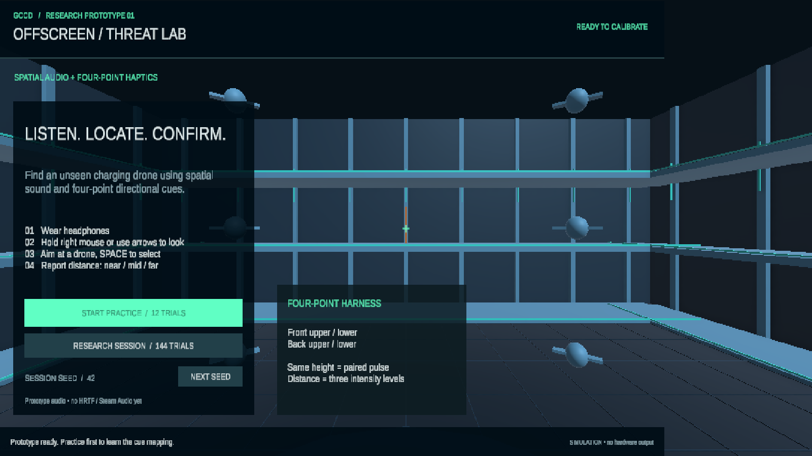

# GCCD · Offscreen Threat Lab

Minimal Haptic Cues for Off-Screen Threat Awareness in Games

**공간 음향과 4개 진동 파츠를 이용한 위협 위치 탐색 연구용 Unity 모의 게임**입니다. 플레이어는 관측 플랫폼에서 카메라를 돌려 소리를 낸 드론을 선택하고, 거리를 응답합니다.

> 현재는 **프로토타입**입니다. Unity 기본 3D 음향과 모의 차폐를 사용합니다. Steam Audio / HRTF, 실제 하네스 드라이버, 지각 강도·출력 지연 보정은 아직 구현·검증되지 않았습니다. 기본 모드에서는 실제 진동이 발생하지 않습니다. 이 상태의 결과를 촉각 효과 검증 자료로 해석하면 안 됩니다.



## 바로 실행

1. 저장소를 내려받고 **Unity Hub → Add → GCCD_Project** 폴더를 선택합니다.
2. **Unity 6000.3.10f1 (Unity 6.3 LTS)**으로 엽니다.
3. `Assets/GCCD/Scenes/ThreatLab.unity`를 열고 ▶ Play를 누릅니다.
4. `START PRACTICE`로 조작과 신호 매핑을 익힙니다. 게임 화면은 영어, 사용 문서는 한국어입니다.

| 조작 | 동작 |
|---|---|
| 마우스 오른쪽 버튼을 누른 채 이동 | 시점 회전 |
| 방향키 | 시점 회전 대체 조작 |
| Space / CONFIRM AIM | 조준점과 가장 가까운 드론 선택, 허용 각도 8° |
| R / REPLAY SIGNAL | 같은 신호 다시 듣기. 횟수 기록 |
| NEAR / MID / FAR | 거리 응답 |
| CONTINUE | 다음 시행 |
| Esc | 탐색 중 세션 종료, 부분 기록 저장 |
| NEXT SEED | 순서·자극 난수 시드 변경 |

선택 후에는 거리 버튼을 클릭합니다. 같은 드론을 재선택할 수 없으며 최초 응답이 기록됩니다. 창의 포커스를 잃으면 활성 시행은 `focus_lost`로 저장되고 세션을 종료합니다. 드론은 동일한 외형이며 신호를 내는 동안 정답 표시를 하지 않습니다.

## 구현 내용

- 3개 높이의 탐색 공간과 18개 드론. 관찰자 위치 고정, 시점 회전 자유.
- 0.65초의 생성 음원, Unity 3D 패닝·거리 감쇠, 모의 차폐 필터.
- `AudioOnly`, `AlertOnly`, `Direction`, `DirectionAndDistance`의 4개 조건.
- 앞 위 / 앞 아래 / 뒤 위 / 뒤 아래의 4채널 매핑.
- 같은 높이는 해당 면의 두 파츠를 동시에 활성화. 높이는 세계 좌표, 전후방은 신호 시작 순간 수평 카메라 방향 기준.
- 연습 12회: 조건마다 무작위 3회, 진동 시각화·정답 피드백 제공. 균형 실험이 아님.
- 본 실험 144회: 조건마다 전후 2 × 높이 3 × 거리 3 × 차폐 2 = 36회. 조건 순서는 4그룹 균형 Latin square, 조건 내부 순서는 시드 기반 셔플.
- 20초 탐색 제한, 최초 선택 시간, 전체 응답 시간, 전후·높이·거리 정오답, 재청취 횟수, 회전량 등을 CSV 저장.
- 선택적인 로컬 UDP 출력 연결점. 하드웨어 펌웨어는 포함하지 않음.

## 결과 위치

`Application.persistentDataPath/Sessions/gccd_<UTC시간>.csv`에 시행마다 즉시 저장됩니다. 완료 화면에서 `OPEN RESULTS FOLDER`로 열 수 있습니다.

macOS 기본 경로: `~/Library/Application Support/GCCD/GCCD Threat Lab/Sessions/`

개인정보 입력·서버 전송은 없습니다. CSV와 빌드 결과는 Git에서 제외됩니다. 자동 검증이 생성하는 CSV도 합성 응답이므로 연구 데이터와 분리하세요.

```sh
python3 Tools/analyze_session.py /path/to/gccd_session.csv
```

## 개발·검증

- `GCCD/Run Model Checks`: 시행 균형·시드 재현성·공간 분류·모터 값 범위 확인.
- `GCCD/Create Research Lab`: 데모 씬을 재생성하는 개발 메뉴. 기존 `ThreatLab.unity`를 덮어쓰므로 수정한 씬이 있다면 먼저 복사하세요.
- Play Mode에서 `LabVerification.Run()`을 실행하면 144회 정답 응답, 오답, 시간초과, 중단, 재청취와 CSV 내용을 검증합니다. 외부 장치 출력은 끈 상태로 수행합니다.
- `LabBuilder.BuildMac()` 또는 Build Profiles에서 macOS 빌드가 가능합니다.
- 검증 결과는 [docs/VALIDATION.md](docs/VALIDATION.md), 상세 실험 사양은 [docs/PROTOCOL.md](docs/PROTOCOL.md)를 참고하세요.

## 구조

```text
GCCD_Project/
  Assets/GCCD/
    Scenes/ThreatLab.unity
    Scripts/ResearchModel.cs   # 실험 설계 / 분류 / 모터 매핑
    Scripts/ThreatLab.cs       # 상태 전이 / 입력 / 음향 / CSV
    Scripts/HapticOutput.cs    # 시뮬레이션 / 선택적 UDP
    Scripts/LabUI.cs           # uGUI + TextMeshPro 화면
    Editor/LabBuilder.cs       # 씬 생성 / 모델 점검 / macOS 빌드
    Editor/LabVerification.cs  # 플레이 흐름 자동 검증
  Packages/
  ProjectSettings/
```

Unity 템플릿의 SampleScene과 기존 패키지 구성은 보존했습니다. 게임의 도형·음원은 코드로 생성하며, UI는 Unity TMP Essentials의 Liberation Sans 리소스를 사용합니다.
