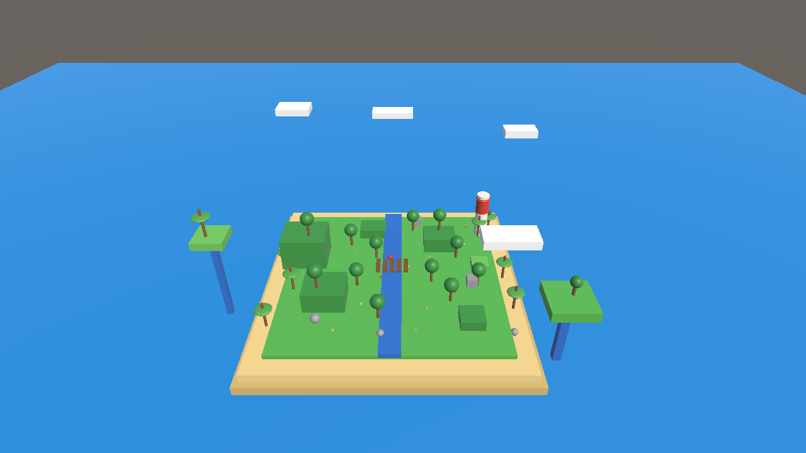

# GCCD — FunIsland 연속 3D 햅틱 연구 맵

팀원의 FunIsland 맵에 TactSuit X40용 플레이어 기준 360° 방위각, ±90° 높이, 거리 기반 연속 햅틱 시스템을 통합했습니다. 방향별 Designer 이벤트 없이 40개 모터의 가중치를 계산합니다.

## 실행

1. Unity Hub에서 `GCCD_Project`를 **Unity 6000.3.24f1**로 엽니다.
2. `Assets/_Project/Scenes/FunIslandHaptics.unity`를 엽니다. 메뉴 `GCCD > FunIsland > Open Haptic Research Map`도 가능합니다.
3. Play 후 Game 화면 클릭: WASD 이동, Shift 달리기, Space 점프, 마우스 시점, Esc 커서 해제. **T**는 붉은 위협의 이동 정지/재개입니다.
4. `ContinuousHaptics`를 선택하면 Inspector에 거리·각도·세기와 40모터 미리보기가 표시됩니다. 기본은 장치 출력이 꺼진 미리보기입니다. 기본 화면 밖 필터 때문에 보이는 위협에는 출력하지 않습니다.
5. Controller의 Test Mode를 켜면 방위각·높이·거리 슬라이더를 직접 조작할 수 있습니다. LinearInterpolation/Gaussian/Nearest와 Continuous/Discrete3Level 조건을 비교합니다.

## 실제 X40 사용

SDK와 계정 키는 저장소에 포함하지 않습니다. SDK 없이도 맵·계산·미리보기·CSV를 사용할 수 있습니다.

1. bHaptics Haptic Plugin **2.8.1 (SDK2)**을 로컬 설치하고 Developer Window에서 App ID/API Key를 설정합니다.
2. `GCCD > Continuous Haptics > Enable Installed bHaptics SDK`를 실행합니다.
3. bHaptics Player에서 X40 한 대를 연결합니다. Controller를 비활성화하고 Output의 단일 모터 교정 기능으로 실제 위치를 먼저 확인합니다.
4. Controller를 다시 활성화하고 **Enable Haptics**를 켭니다. 공식 SDK 초기화 컴포넌트는 필요할 때 자동 생성됩니다. Designer 방향 패턴은 필요 없습니다.

실제 조끼의 진동·체감은 아직 검증하지 않았습니다. 자세한 교정 순서와 제한은 사용 설명서를 참고하세요.

## 문서

- [사용 설명서: 구조, 수식, 설정, 실험, 제한](docs/CONTINUOUS_HAPTICS.md)
- [설치 SDK/API 및 X40 인덱스 조사](docs/SDK_AUDIT.md)
- [자동 검증 결과](docs/VALIDATION.md)
- [이전 4방향 프로토타입 사용법](docs/LEGACY_PROTOTYPE.md)

`Assets/FunIsland`은 팀원 제공 맵을 가져온 폴더입니다. 가져온 이동 코드는 Input System에 맞게 변경했고, 통합 씬은 URP 재질을 사용합니다. 원본 생성 코드·안내는 `docs/FunIslandSource`에 보존했습니다. 기존 `ThreatDirectionTest` 씬은 유지하며 `ContinuousHapticsTest`는 기존 생성기와 새 계산을 비교하는 별도 씬입니다.
